# Отчет по практической части курса "Инженер облачных сервисов"
Данный отчет представляет собой документацию процесса выполнения практических задач из курса. Блоки с теорией не заносятся в документацию

## Глава 01. Начало работы в облаке

### Создание виртуальной машины и подеключение к ней
* Для начала создадим нашу первую виртуальную машину (далее ВМ) через конструктор виртуальных машин. Для этого нажмем кнопку "Создать ВМ" на странице консоли Yandex Cloud, после чего в открывшемся окне повторим действия из курса. Советую поставить галочку напротив "Дополнительно: Прерываемая", поскольку в этом слуучае машина будет жрать меньше ресурсов, которые у нас и так ограничены, а на ее работоспособности это никак не скажется

    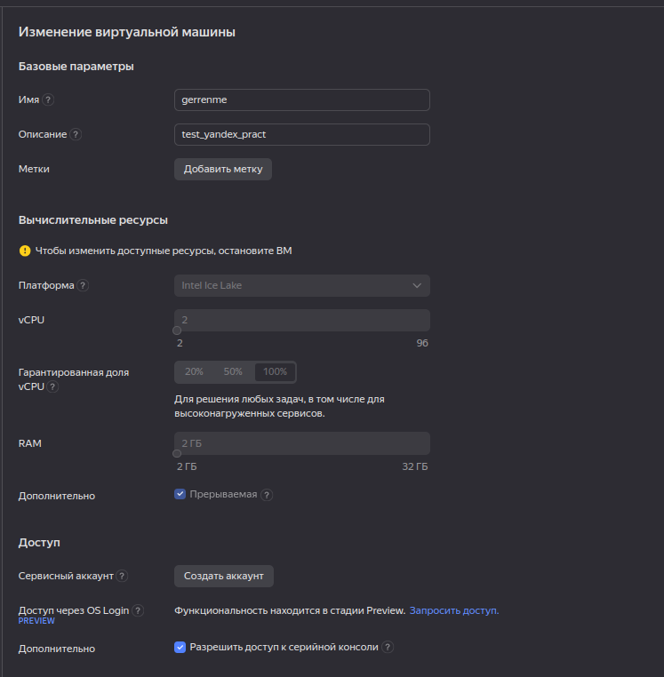
    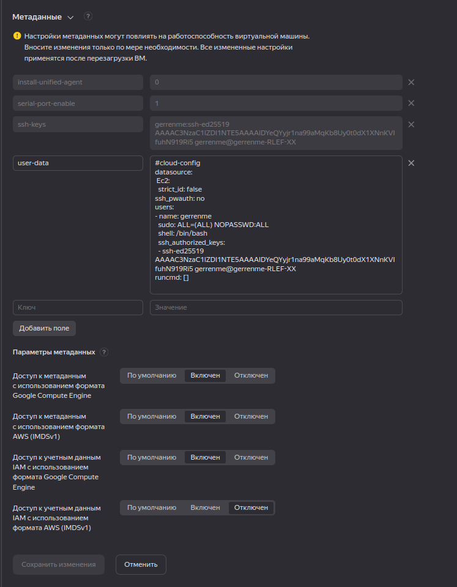

* В разделе "Доступ" необходимо указать логин администратора (далее мы часто будем взаимодействовать с ним), а ниже - ssh ключ от нашего родного терминала. Чтобы сгенерировать новый ключ, необходимо воспользоваться командой ["ssh-keygen -t ed25519"] (данный ключ представляет собой укороченную запись обычного ключа)

    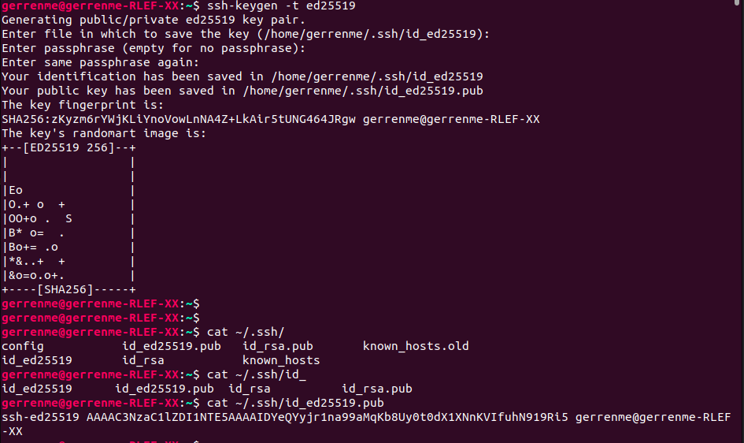

* При создании ключа оставьте все диалоговые окна пустыми (просто жмите клавишу Enter, пока они не перестанут появляться). Поздравляю!! Вы создали свой первый shh ключ (вернее, сразу 2, поскольку одновременно создается приватный и публичный ключ, о чем расскажу далее), который сохранен в папку [*.shh/*]. Теперь необходимо прочитать содержимое ключа при помощи утилиты [*cat*] (если у вас нет данной утилиты, воспользуйтесь командой [*sudo apt-get install cat*]). Для этого укажем полный путь до файла [*cat ~/.ssh/id_ed25519.pub*]. Теперь перенесем наш ключ в поле добавления пользователя, чтобы получить возможность соединяться с машиной через протокол ssh

* Теперь давайте попробуем подключиться к машине, указав ее публичный IP, который можно найти напротив названия машины в консоле ВМ. Для этого пропишем следующую команду: [*ssh <логин>@<публичный IP машины>*]

    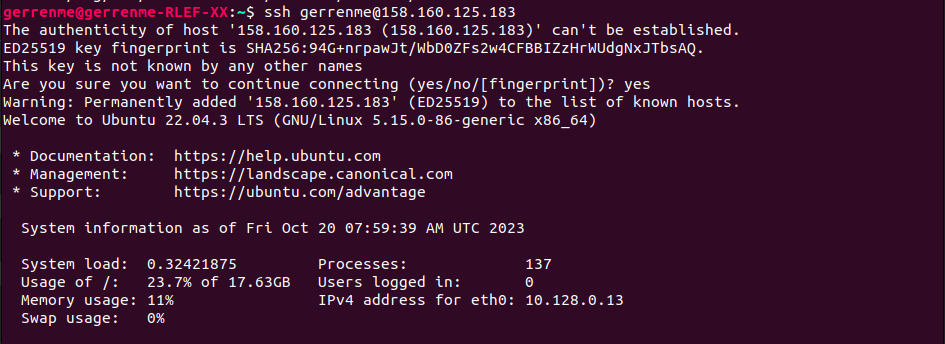

* Также уберем пароль у администратора, чтобы не вводить его при каждом действии (это очень-очень плохая практика, но в учебных целях можно). Для этого воспользуемся командой [*passwd <логин>*]

    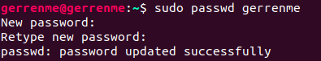

* Теперь самостоятельно пропишите команды [*sudo apt-get update*] и [*sudo apt-get upgrade*], чтобы установить более новые версии уже установленных утилит

### Получение доступа к серийной консоли

* Для подключения к серийной консоли воспользуемся следующей командой: [*ssh -t -p 9600 -o IdentitiesOnly=yes -i ~/.ssh/<имя закрытого ключа> <ID виртуальной машины>.<имя пользователя>@serialssh.cloud.yandex.net*]

    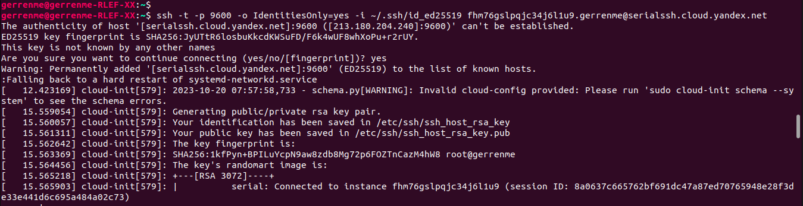

### Создаем ВМ с 5% vCPU и учимся использовать мониторинг

* Для начала создадим ВМ с требуемыми параметрмаи

    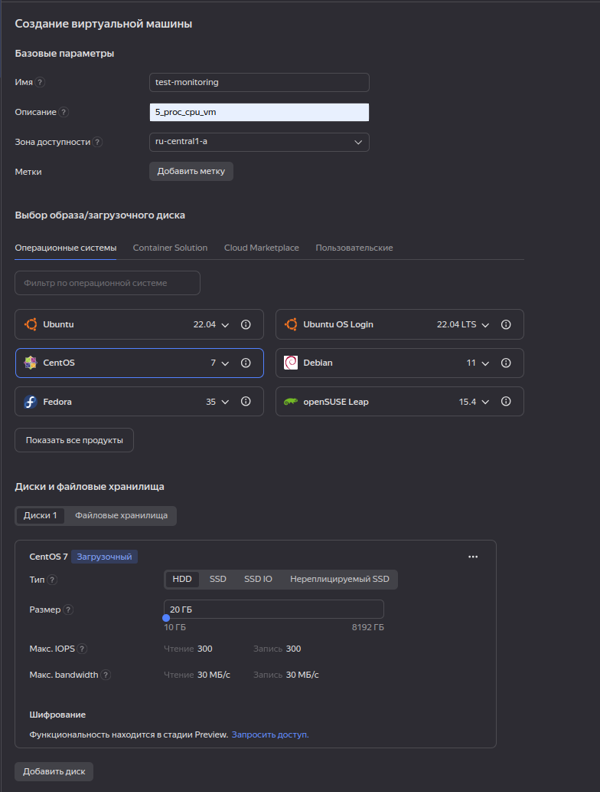
    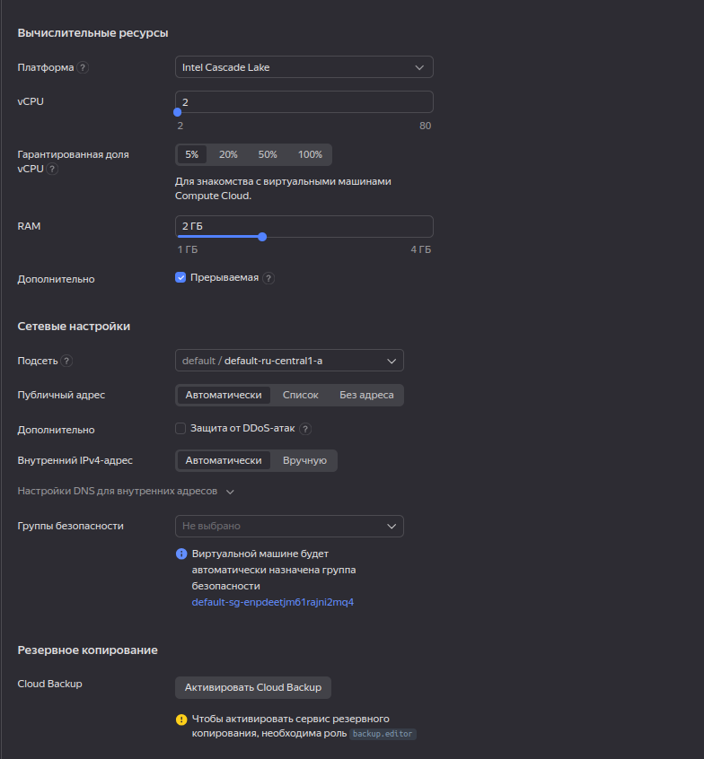
    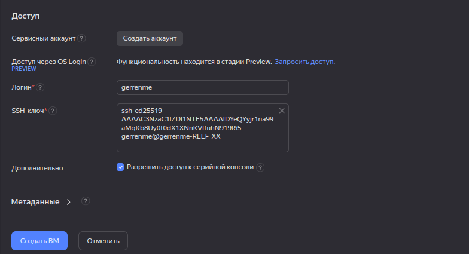

* Теперь нагрузим машину, чтобы удостовериться, что логирование идет как надо. Для этого подключимся к машине через shh и создадим пару файлов

    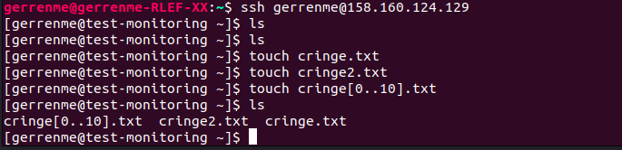

* Теперь првоерим, как поживают логи

    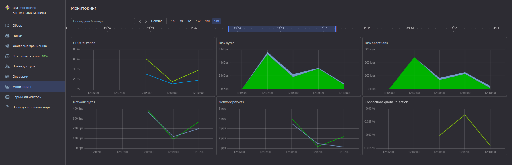

* Как можно заметить, графики отличаются от того, что было в начале. Если вам интересны конкретные цифры по загруженности машины в определенный момент времени, просто наведите курсор на граф

* На этом заканчивается часть с мониторингом. Можете удалить машину

### Практическая работа. Создание новой сети с подсетями и ВМ

* Для начала перейдем на страницу сервиса Virtual Private Cloud и нажмем на кнопку *Создать сеть*. Далее создадим сеть с говорящим названием

    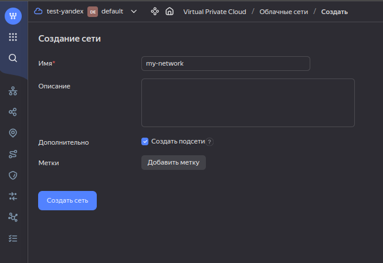

* В результате будут созданы 3 подсети: *my-network-ru-central1-a*, *my-network-ru-central1-b*, *my-network-ru-central1-c*. Теперь создадим еще одну подсеть с маской /28 по заданнмы правилам

    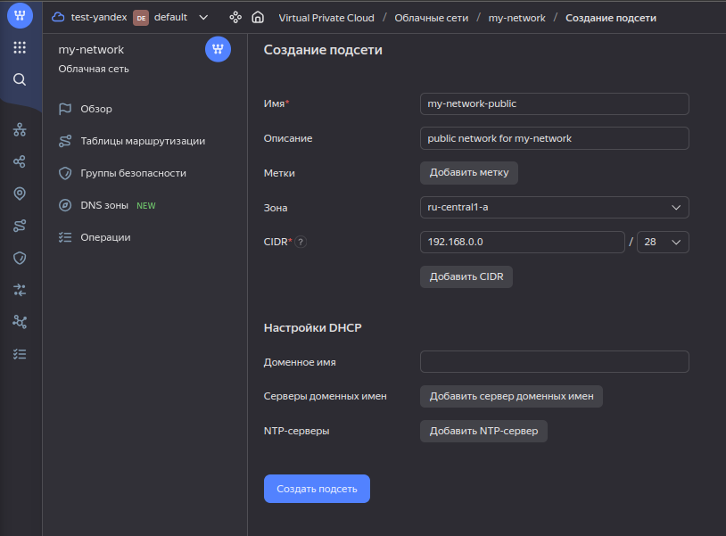

* Теперь создадим ВМ, которая будет выполнять роль веб-сервера по заданным правилам. Удостоверьтесь, что в блоке *Сетевые настройки* в параметре *Подсеть* выбрали подсеть, которую мы создавали ранее

    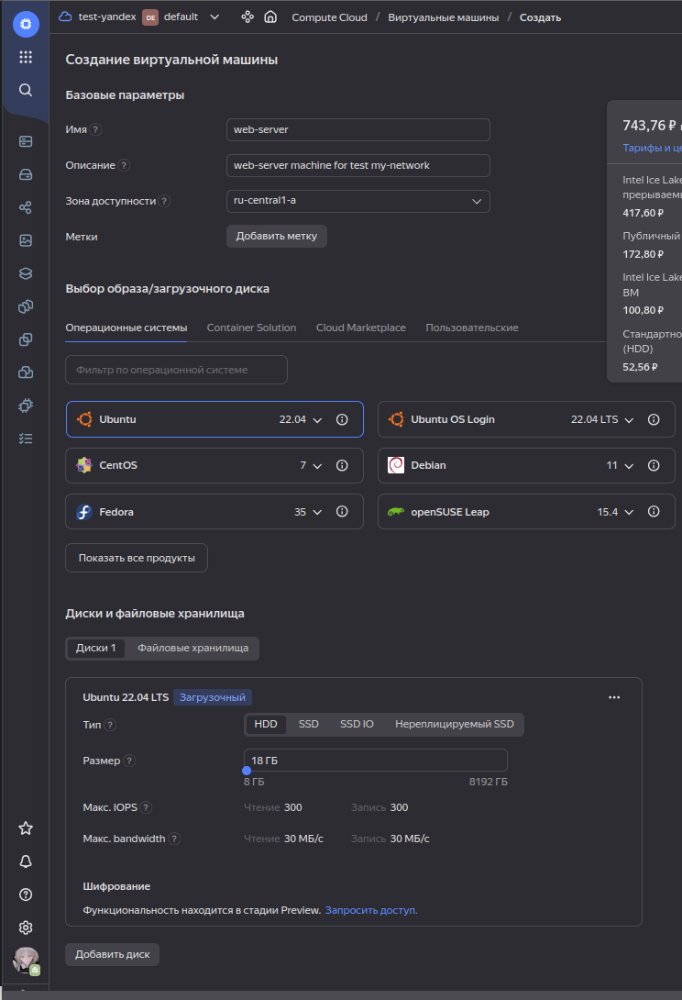
    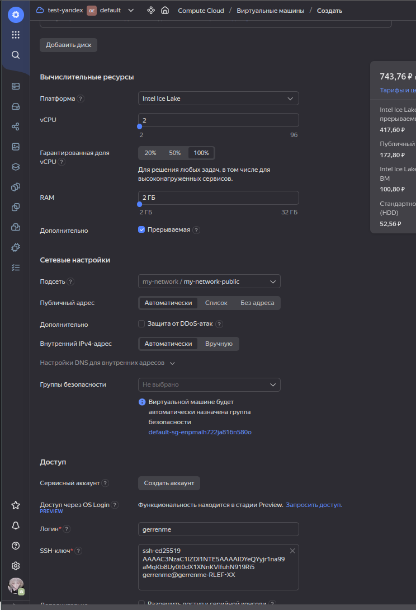

* Теперь проверим, что машина правильно настроена и попробуем достучаться до нее через *ping*

    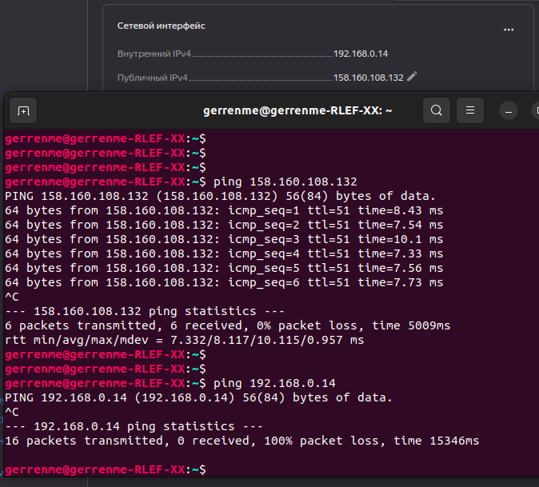

* Поздравляю!! Если пинг проходит, вы верно настроили машину и правильно выполнили все предшествующие этапы. Если что-то пошло не так - повторите действия заново

### Практическая работа. Создаем группу безопасности и открываем доступ к серверу

* Чтобы создать группу безопасности, перейдите по ссылке https://console.cloud.yandex.ru/link/vpc/security-groups, после чего нажмите на кнопку *Создать группу*. Нажмите на кнопку, после чего придумайте говорящее название для своей группы. В моем случае она называется *my-network-security*. Далее в блоке *Правила* укажем несколько правил для нашей группы для входящего и исходящего трафика:

    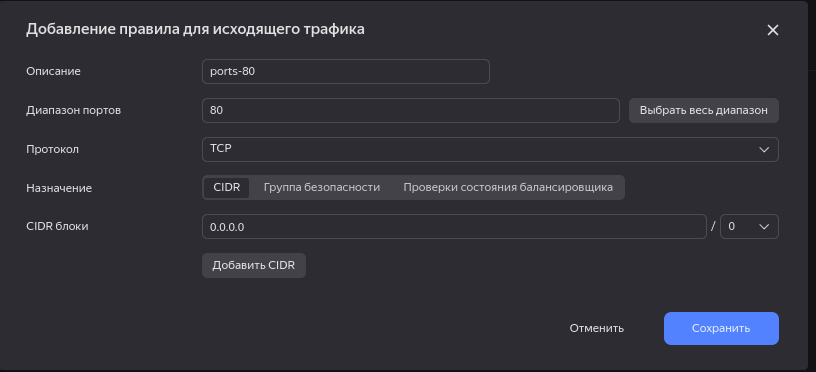
    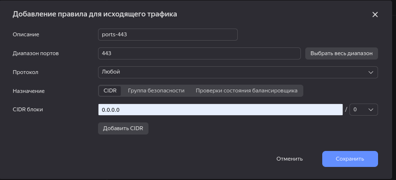
    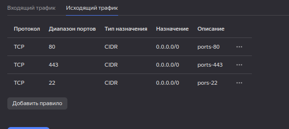
    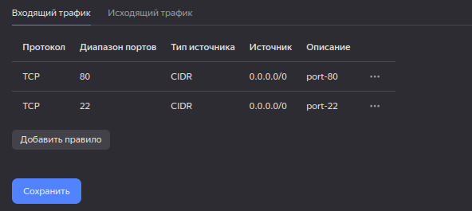

* Теперь проверим наши группы, где должна отобрадаться недавно созданная группа *my-network-security* с 5 правилами

    

* Далее создадим сервер, расположенный в нашей новой сети

    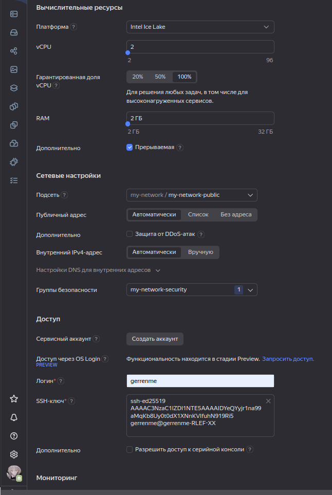 

* Теперь установим на сервер *nginx* командой [*sudo apt-get install nginx*]
    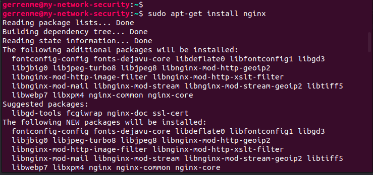

* Перейдем в браузере по публичному адресу сервера и проверим, что *nginx* работает

    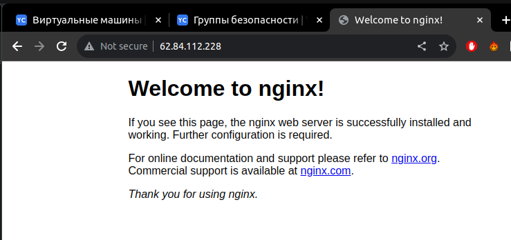

* Поздравляю с завершением настройки группы безопасности и установки *nginx*

### Практическая работа. Знакомство с Yandex Cloud CLI

* Для начала работы с Yandex Cloud CLI необходимо зарегистрироваться в ней. 

## Глава 02. Начало работы в облаке
## Глава 03. Начало работы в облаке
## Глава 04. Начало работы в облаке
## Глава 05. Начало работы в облаке
## Глава 06. Начало работы в облаке

