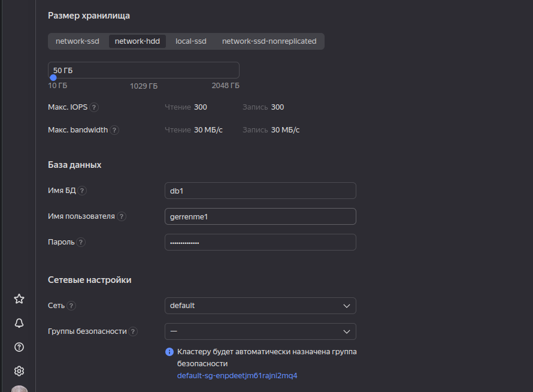
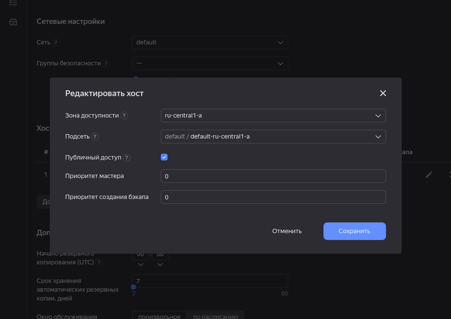
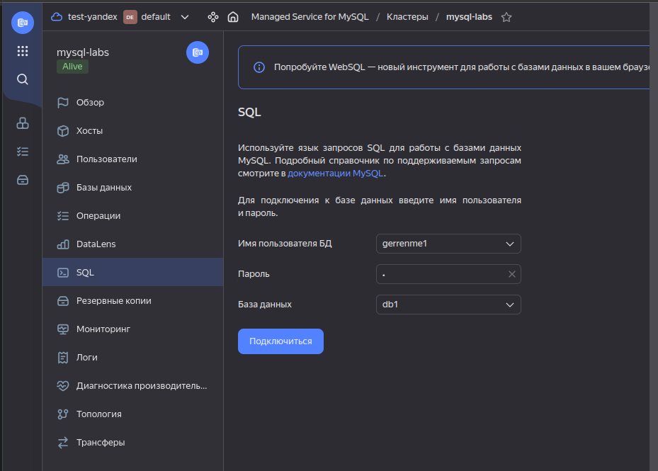

# Отчет по практической части курса "Инженер облачных сервисов"
Данный отчет представляет собой документацию процесса выполнения практических задач из курса. Блоки с теорией не заносятся в документацию

## Глава 01. Начало работы в облаке

### Создание виртуальной машины и подеключение к ней
* Для начала создадим нашу первую виртуальную машину (далее ВМ) через конструктор виртуальных машин. Для этого нажмем кнопку "Создать ВМ" на странице консоли Yandex Cloud, после чего в открывшемся окне повторим действия из курса. Советую поставить галочку напротив "Дополнительно: Прерываемая", поскольку в этом слуучае машина будет жрать меньше ресурсов, которые у нас и так ограничены, а на ее работоспособности это никак не скажется

    
    

* В разделе "Доступ" необходимо указать логин администратора (далее мы часто будем взаимодействовать с ним), а ниже - ssh ключ от нашего родного терминала. Чтобы сгенерировать новый ключ, необходимо воспользоваться командой ["ssh-keygen -t ed25519"] (данный ключ представляет собой укороченную запись обычного ключа)

    

* При создании ключа оставьте все диалоговые окна пустыми (просто жмите клавишу Enter, пока они не перестанут появляться). Поздравляю!! Вы создали свой первый shh ключ (вернее, сразу 2, поскольку одновременно создается приватный и публичный ключ, о чем расскажу далее), который сохранен в папку [*.shh/*]. Теперь необходимо прочитать содержимое ключа при помощи утилиты [*cat*] (если у вас нет данной утилиты, воспользуйтесь командой [*sudo apt-get install cat*]). Для этого укажем полный путь до файла [*cat ~/.ssh/id_ed25519.pub*]. Теперь перенесем наш ключ в поле добавления пользователя, чтобы получить возможность соединяться с машиной через протокол ssh

* Теперь давайте попробуем подключиться к машине, указав ее публичный IP, который можно найти напротив названия машины в консоле ВМ. Для этого пропишем следующую команду: [*ssh <логин>@<публичный IP машины>*]

    

* Также уберем пароль у администратора, чтобы не вводить его при каждом действии (это очень-очень плохая практика, но в учебных целях можно). Для этого воспользуемся командой [*passwd <логин>*]

    

* Теперь самостоятельно пропишите команды [*sudo apt-get update*] и [*sudo apt-get upgrade*], чтобы установить более новые версии уже установленных утилит

### Получение доступа к серийной консоли

* Для подключения к серийной консоли воспользуемся следующей командой: [*ssh -t -p 9600 -o IdentitiesOnly=yes -i ~/.ssh/<имя закрытого ключа> <ID виртуальной машины>.<имя пользователя>@serialssh.cloud.yandex.net*]

    

### Создаем ВМ с 5% vCPU и учимся использовать мониторинг

* Для начала создадим ВМ с требуемыми параметрмаи

    
    
    

* Теперь нагрузим машину, чтобы удостовериться, что логирование идет как надо. Для этого подключимся к машине через shh и создадим пару файлов

    

* Теперь првоерим, как поживают логи

    

* Как можно заметить, графики отличаются от того, что было в начале. Если вам интересны конкретные цифры по загруженности машины в определенный момент времени, просто наведите курсор на граф

* На этом заканчивается часть с мониторингом. Можете удалить машину

### Практическая работа. Создание новой сети с подсетями и ВМ

* Для начала перейдем на страницу сервиса Virtual Private Cloud и нажмем на кнопку *Создать сеть*. Далее создадим сеть с говорящим названием

    

* В результате будут созданы 3 подсети: *my-network-ru-central1-a*, *my-network-ru-central1-b*, *my-network-ru-central1-c*. Теперь создадим еще одну подсеть с маской /28 по заданнмы правилам

    

* Теперь создадим ВМ, которая будет выполнять роль веб-сервера по заданным правилам. Удостоверьтесь, что в блоке *Сетевые настройки* в параметре *Подсеть* выбрали подсеть, которую мы создавали ранее

    
    

* Теперь проверим, что машина правильно настроена и попробуем достучаться до нее через *ping*

    

* Поздравляю!! Если пинг проходит, вы верно настроили машину и правильно выполнили все предшествующие этапы. Если что-то пошло не так - повторите действия заново

### Практическая работа. Создаем группу безопасности и открываем доступ к серверу

* Чтобы создать группу безопасности, перейдите по ссылке https://console.cloud.yandex.ru/link/vpc/security-groups, после чего нажмите на кнопку *Создать группу*. Нажмите на кнопку, после чего придумайте говорящее название для своей группы. В моем случае она называется *my-network-security*. Далее в блоке *Правила* укажем несколько правил для нашей группы для входящего и исходящего трафика:

    
    
    
    

* Теперь проверим наши группы, где должна отобрадаться недавно созданная группа *my-network-security* с 5 правилами

    

* Далее создадим сервер, расположенный в нашей новой сети

     

* Теперь установим на сервер *nginx* командой [*sudo apt-get install nginx*]
    

* Перейдем в браузере по публичному адресу сервера и проверим, что *nginx* работает

    

* Поздравляю с завершением настройки группы безопасности и установки *nginx*

### Практическая работа. Знакомство с Yandex Cloud CLI

* Для начала работы с Yandex Cloud CLI необходимо зарегистрироваться в ней и создать профиль. Для начала выполним команду [*yc init*], после чего выполним регистрацию аккаунта (полная документация по регистрации находится по ссылке -> https://cloud.yandex.ru/docs/cli/quickstart)

    

* Далее проверим, что мы успешно зарегистрировались, воспользовавшись командой [*yc config lsit*], которая должна показать параметры нашего профиля

    

* Теперь создадим ВМ **demo-1** при ппомощи Yandex Command Line

    

* И сразу повторим аналогичные шаги для машины **demo-2**

    

* Наконец, проверим работоспособность созданных машин, открыв в браузере страницу с их местоположением

    
    

### Практическая работа. Создание балансировщика

* Для создания балансировщика перейдем в раздел *__Network Load Balancer__* -> *__Целевые группы__* -> *__Создать__*, после чего создадим **целевую группу**, куда поместим машины **demo-1** и **demo-2**

    

* После чего добавим ***обработчик*** и поставим его на **80-й** порт, попутно настроив проверку состояния, как сказано в курсе

    
    

* Тперь удостоверимся, что правильно выполнили все действия и проверим состояние целевой группы, в которой должны отображаться добавленные машины

    

* Теперь откроем адрес балансировщика - мы должны попасть на менее нагруженную машину (в моем случае это **demo-1**, но в вашем случае это спокойно может быть **demo-2**)
    
    

* Если состояние машины корректно отображается, попробуем отключить ту машину, чью страницу мы видим

    

* Как мы видим, абсолютно по тому же адресу балансировщика открывается страница машины **demo-2**, что говорит о полной работоспособности нашего балансировщика

### Практическая работа. Создание группы виртуальных машин

* Для начала создадим **группу виртуальных машин**. Для этого перейдем в раздел **Compute Cloud** -> **Группы виртуальных машин** -> **Создать группу**

    

* Далее создадим новый аккаунт и присвоим ему права "**editor**"

    

* Теперь создадим **Шаблон** ВМ

    
    
    

* Завершим создание **Группы виртуальных машин** и проверим их статус

    

* Как мы видим, при создании группы автоматически создались 2 машины, которые отображаются в активных машинах группы на графике слева. Теперь попробуем отключить одну из машин и проверим статус группы

    

* Статус группы изменился, что говорит о благополучной работе группы. Теперь создадим еще одну групу, но в этот раз **максимальный размер** группы уеличим с ***2-х*** машин да ***4-х***

    

* Проверим статус группы и заметим, что он изменился от того, который был раньше
    

### Практическая работа. Воссоздание виртуальных машин в группе

* Для начала установим утилиту, которая позволит протестировать работоспособность наших машин в стрессовых ситуациях, а также удостоверимся, что машины в данный момент ничем не нагруженны

    
    

* Теперь запустим утилиту и проверим нагрузку машин

    
    

* При загрузке текущих машин группа должна автоматически создать новые машины и распределить нагрузку между ними. Проверим статус группы

    
    

* На этом закончим с первой главой курса и перейдем ко второй

## Глава 02. Хранение и анализ данных

### Практическая работа. Создание бакетов и загрузка объектов

* Чтобы создать бакет, необходимо перейти в раздел **Object Storage** -> **Бакеты** -> **Новый бакет**. Назвоем бакет именем *klinika-bicket*

    

* Теперь вручную загрузим снимок пациента и удостоверимся, что он доступен в бакете

    
    

* После попробуем добавить другой снимок пациента через терминал машины. Для этого установим утилиту **s3cmd**, после чего воспользуемся командой **--configure**, чтобы задать настройки утилите. Также проверим, удалось ли подлючиться к нашему бакет командой **s3cmd ls**

    
    

* Теперь передадим снимок пациента командой **s3cmd put**, в аргументах которой укажем путь до снимка, а также путь до бакета в объектном хранилище

    

* Теперь создадим жизненный цикл бакета, чтобы своевременно очищать хранилище. Для этого перейдем в раздел **Object Storage** -> **Бакеты** -> **klinika-bucket** и перейдем во вкладку **Жизненный цикл** 

    

* Теперь изменим метаданные снимков командой **s3cmd modify** и проверим измененные метаданные снимков

    
    

### Практическая работа. Создание кластера базы данных MySQL && Подключение к базе данных

* Для создания кластера перейдем в раздел **Managed Services for MySQL** -> **Кластеры** -> **Создать** и заполним поля в соответствии с инструкцией 

    
    
    
    
    
    

* Теперь проверим, правильно ли мы создали кластеры. Для этого проверим статус кластера

    

* После этого попробуем подключиться к БД через Yandex Cloud из вкладки **SQL**. При успешном подключении к базе данных у нас откроется консоль SQL

    
    

* Напишем запрос-вставку к терминал и проверим, успешно ли прошел запрос, открыв сущность **ratings** базы данных **db1**

    

* Далее попробуем произвести запрос из локальной машины. Для этого создадим текстовый файл с запросом, затем подключимся к клстеру, использую команду из курса

    
    
    

 * Теперь удостоверимся, что успешно подключились и можем работать с БД. Для этого выведем версию базы данных запросом *__SELECT version();__*

    

* Далее воспроизведем запрос с созданием сущности **users**

    

### Практическая работа. Создание кластера базы данных 

## Глава 03. DevOps и автоматизация
## Глава 04. Serverless
## Глава 05. Безопасность
## Глава 06. Прогнозирование затрат и оптимизация

